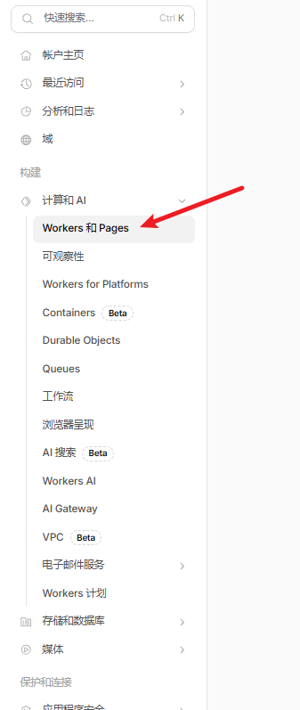
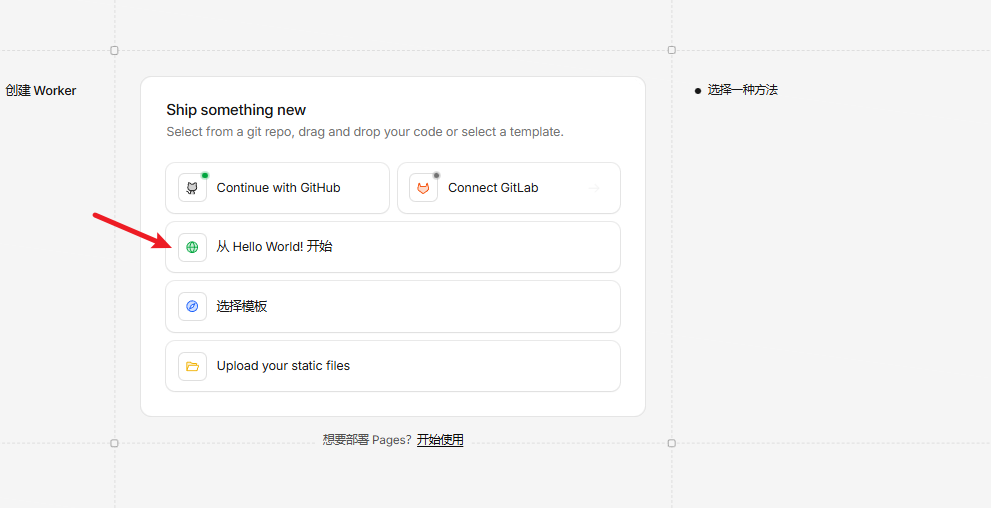
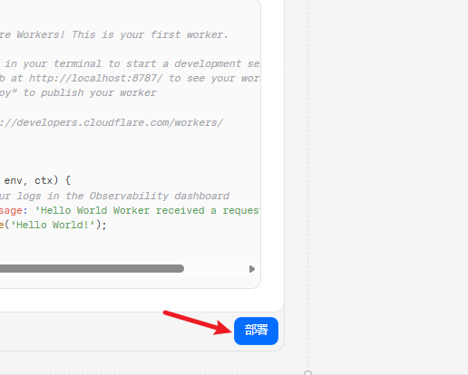
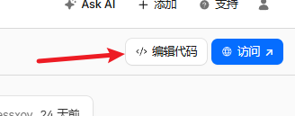
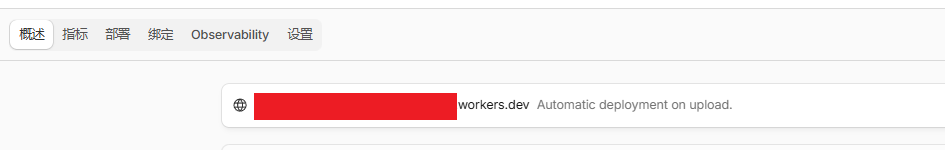
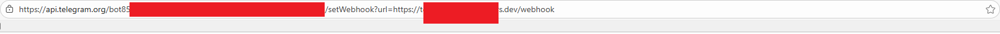

[中文](README.md) | [English](README_EN.md)

# Telegram Group Management Bot

A self-use Telegram group spam deletion bot based on Cloudflare Workers.
Feel free to fork, but please keep the [Credits](#credits) section.

## Features
- Link deletion
- Contact card deletion
- External reference reply deletion
- Keyword detection
- Bio detection

## Prerequisites

### 1. Create a Telegram Bot
1. Search for **@BotFather** on Telegram
2. Send `/start`
3. Send `/newbot`
4. Follow the prompts to enter:
   - Bot name
   - Bot username (must end with `bot`)
5. Get the **Bot Token**, format example:123456789:AAxxxxxxxxxxxxxxxxxxxx

### 2. Add Bot to Group Chat
- Add the bot to the group you want to manage
- Set it as **Administrator**
- Enable at least the following permissions:
  - Delete messages
  - Read messages

## Deployment

### 1. Create a Worker
1. 
2. 
3. 
4. 
5. Select the Worker you just created and add worker.js
   
6. Modify the bot token
```javascript
const BOT_TOKEN = 'xxxxxxx';
```
Replace `xxxxxxx` with your own bot token
7. Modify the whitelist, which contains user IDs whose messages won't be checked by the bot
```javascript
const WHITE_LIST_ID = new Set([
	123456,
	78945612
]);
```
   This uses user IDs. If you don't know what an ID is, please join the group to ask: https://t.me/oyDevelopersClub
8. Remember to click deploy after modifications

## Set Webhook

When everything is ready, visit in your browser:https://api.telegram.org/bot<BOT_TOKEN>/setWebhook?url=https://<WORKER_URL>/webhook


For example: `https://api.telegram.org/bot123456789:AAxxxxxxxxxxxxxxxxxxxx/setWebhook?url=https://aaaabbbb.workers.dev/webhook`



After successful setup, you'll see this message:
```json
{"ok":true,"result":true,"description":"Webhook is set"}
```

## Credits

Author: OuYang ([@OuYang](https://t.me/ouyoung))

If you encounter any issues during deployment, feel free to ask for help in the group: https://t.me/oyDevelopersClub